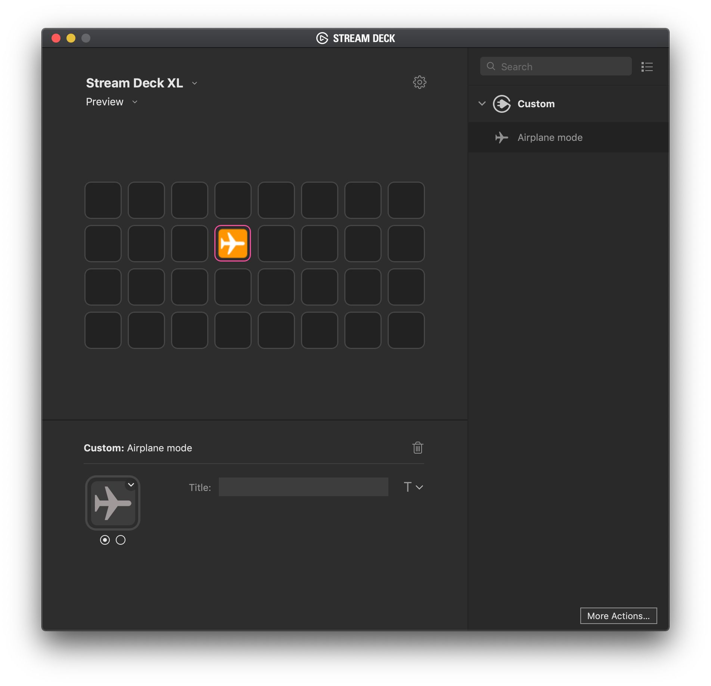

# AirplaneMode

This `AirplaneMode` plug-in for [Stream Deck](https://www.elgato.com/gaming/stream-deck) makes it possible to disable your internet connection by a single press on a button on your Stream Deck.
Implementation is based on the example plugin `AppleMail` provided by [Elgato](https://github.com/elgatosf/streamdeck-applemail).

# Description

`AirplaneMode` makes it possible to block all internet activity. Pressing on the key will disconnect your internet. Pressing another time will bring you online again.

# Features

- Detect and switch your network location
- code written in Objective-C
- run AppleScript
- macOS only

# Installation

In the Release folder, you can find the file `me.hckr.airplanemode.streamDeckPlugin`. If you double-click this file on your machine, Stream Deck will install the plugin.

# Source code

The Sources folder contains the source code of the plugin.
